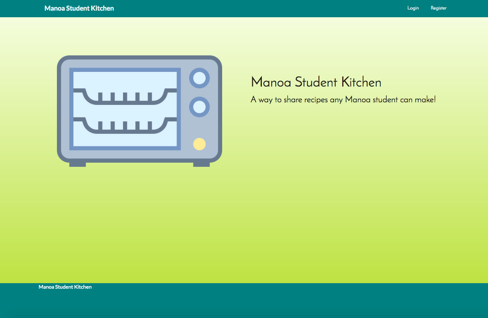
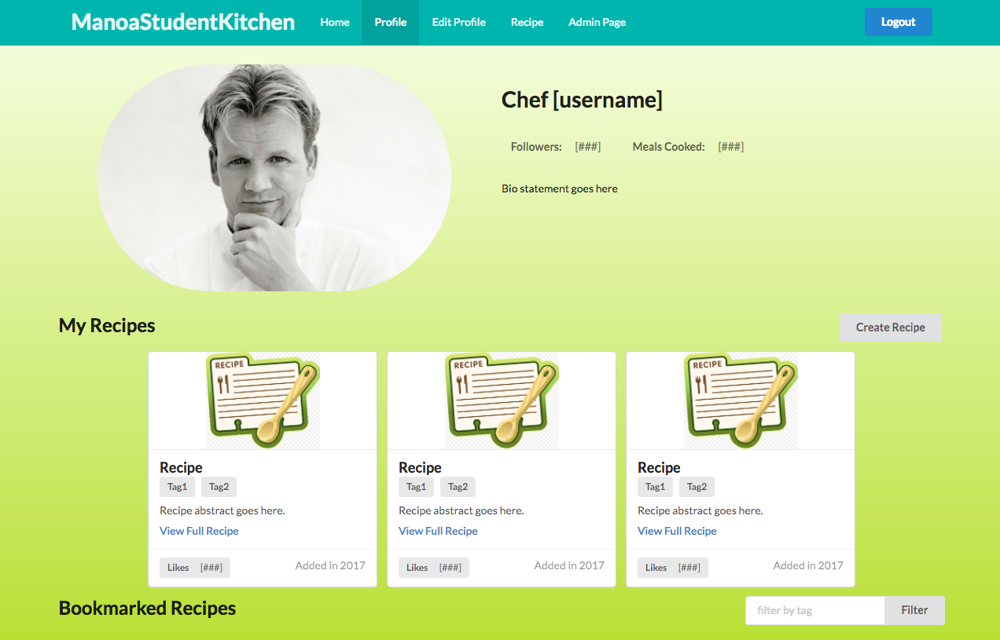
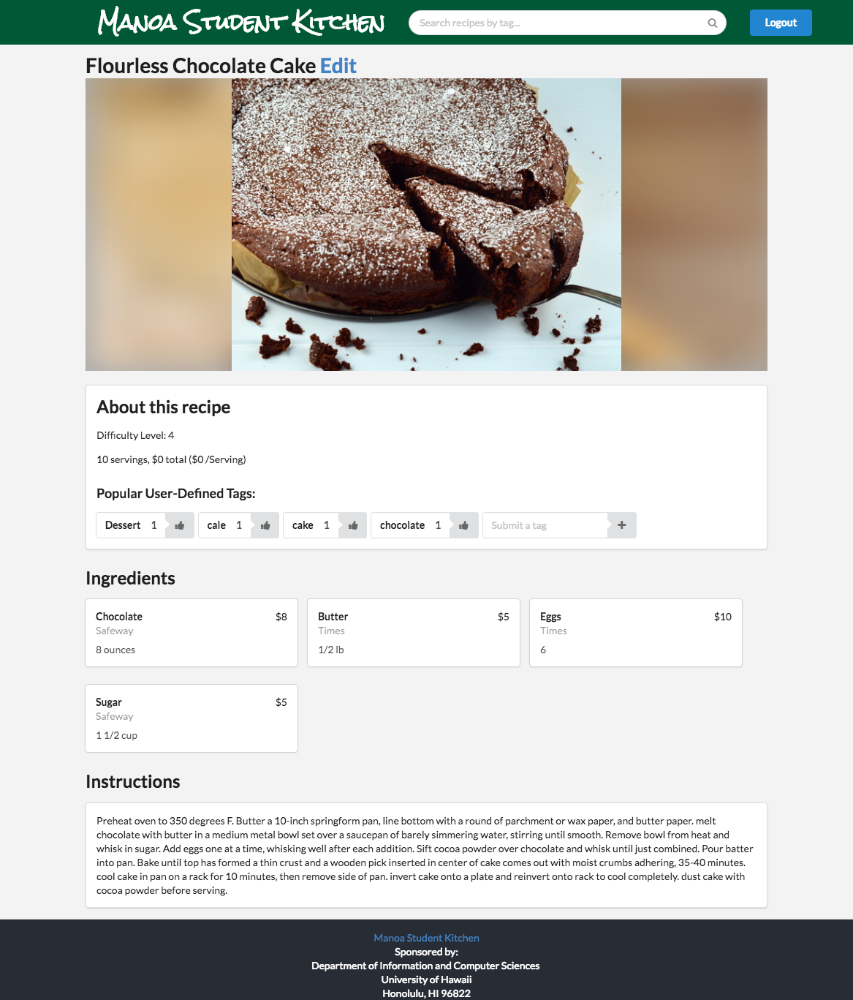
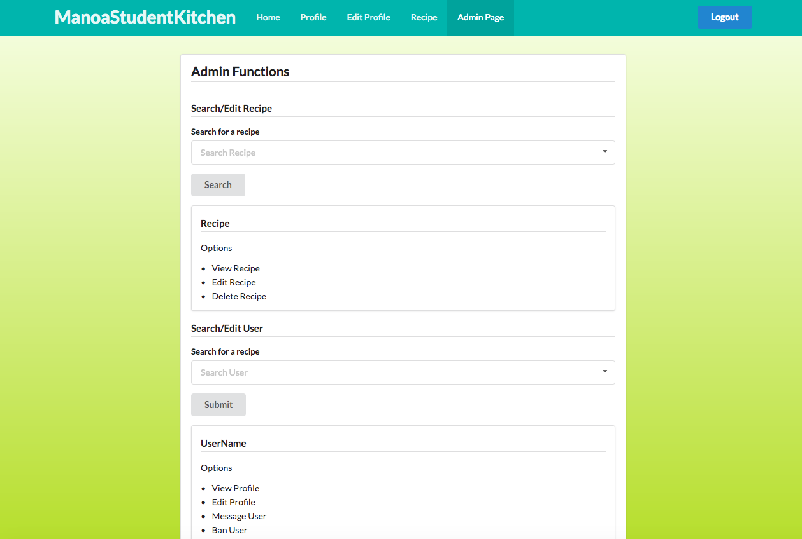
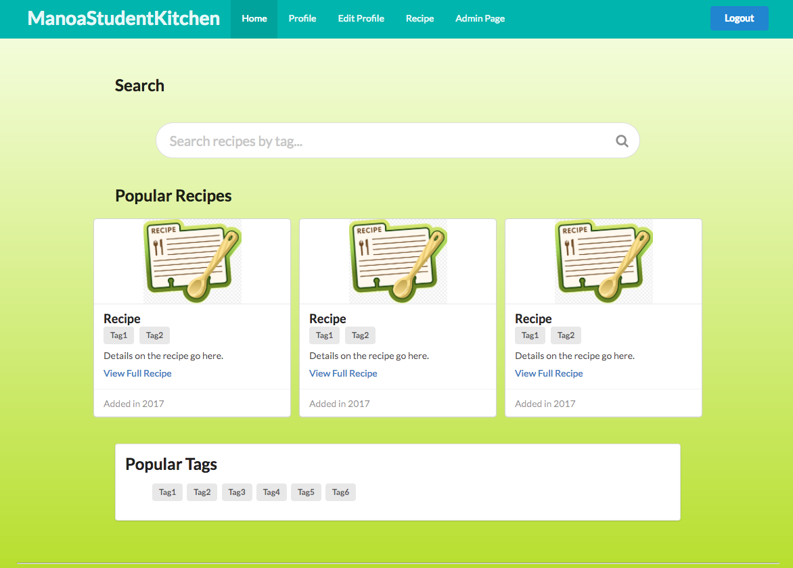

# About Manoa Student Kitchen

Manoa Student Kitchen is an application that provides students at UH Manoa to share and browse any recipe that:

* Can be made using minimal kitchen facilities (at a minimum, a toaster oven).
* Can be made out of ingredients that are available within walking distance of UH.
* Suits local taste sensibilities.

It provides a variety of information about the recipes, including:

* Instructions for the recipe
* Total cost, cost per serving & number of servings
* How long it takes to make.
* Where and for how much each ingredient can be purchased
* Dynamic, user-based tags with a scoring system

Manoa Student Kitchen is based on the project [Toaster Oven Lovin](http://courses.ics.hawaii.edu/ics314s17/morea/final-project/reading-project-toaster-oven-lovin.html)

The current app deployment can be seen [here](http://manoastudentkitchen.meteorapp.com/)

Link to our github organization [here](https://github.com/manoastudentkitchen)

# Guided Tour


The landing page of the website prompts a user to log in using their UH credentials.


After logging in, the user is shown different ways to navigate. The user can search for tags or recipe titles using the search bar, or select one of the tags or recipes on the page.


The recipe page displays information about each recipe.


The profile page displays information about each user.

The admin page allows admins easy access to useful functions, as well as the entire database.


Inspired by [Steam tags](http://store.steampowered.com/tag/), we forewent the traditional categorization system and instead, implemented a system that allows users to define their own tags and upvote tags made by others. This allows for much more flexible and dynamic labelling for each recipe. 

# Developer Guide
## How to Install
First clone the repository from [Github](https://github.com/manoastudentkitchen/manoastudentkitchen). Then cd into the app directory and type:
```
$ meteor npm install
```
This will install the meteor dependancies.

Next, you need to create the settings.json file (for server install), as well as a settings.development.json file (for local install) in the application's config folder.

The contents of the settings.development.json file should look like this:
```
{
  "cas": {
    "baseUrl": "https://cas-test.its.hawaii.edu/cas/",
    "autoClose": true
  },
  "public": {
    "cas": {
      "loginUrl": "https://cas-test.its.hawaii.edu/cas/login",
      "serviceParam": "service",
      "popupWidth": 810,
      "popupHeight": 610
    },
    "initialDatabaseFileName": "database/initial-collection-data.json"
  }
}

```
The contents of the settings.json file should look like this (requires setting up a mongodb and galaxy account):
```
{
  "galaxy.meteor.com": {
    "env": {
      "MONGO_URL": [[The Mongo DB URL]]
    }
  },
  "cas": {
    "baseUrl": "https://cas-test.its.hawaii.edu/cas/",
    "autoClose": true
  },
  "public": {
    "cas": {
      "loginUrl": "https://cas-test.its.hawaii.edu/cas/login",
      "serviceParam": "service",
      "popupWidth": 810,
      "popupHeight": 610
    },
    "initialDatabaseFileName": "database/initial-collection-data.json"
  }
}

```

Next, to run the app locally, type:
```
$ meteor npm run startlocal
```
The application should now be running at localhost:3000.


# Initial User Study

# Development History

The development process for BowFolios conformed to Issue Driven Project Management practices. In a nutshell, development consists of a sequence of Milestones. Milestones consist of issues corresponding to 2-3 day tasks. GitHub projects are used to manage the processing of tasks during a milestone.

The following sections document the development history of Manoa Student Kitchen.

## Milestone 1: Mockup development

This milestone was started on April 5, 2017 and ended on April 13, 2017.

The goal of Milestone 1 was to create a set of HTML pages providing a mockup of the pages in the system. To simplify things, the mockup was developed as a Meteor app. This meant that each page was a template and that FlowRouter was used to implement routing to the pages.

Mockups for the landing, profile, edit profile, recipe, admin and home pages were implemented during M1:







M1 was implemented as the [MSK Milestone 1](https://github.com/manoastudentkitchen/manoastudentkitchen/milestone/1?closed=1):


Milestone 1 consisted of eleven issues, and progress was managed via the [MSK GitHub Project M1](https://github.com/manoastudentkitchen/manoastudentkitchen/projects/1):


Each issue was implemented in its own branch, and merged into master when completed:


## Milestone 2: Data model development

The goals for Milestone 2 were to revamp the visuals of each page, set up the main MongoDB Collections and connect those Collections to the HTML frontend.

Extending from the [Bowfolios](https://bowfolios.github.io/) BaseCollection class, three javascript classes were implemented: RecipeCollection, TagCollection and ProfileCollection, each providing the necessary data structures for recipes, tags and profiles, respectively.

M2 was implemented as the [MSK Milestone 2](https://github.com/manoastudentkitchen/manoastudentkitchen/milestone/2?closed=1):


Milestone 2 consisted of ten issues, and progress was managed via the [MSK GitHub Project M2](https://github.com/manoastudentkitchen/manoastudentkitchen/projects/2):


Each issue was implemented in its own branch, and merged into master when completed:


## Milestone 3: Connect UI to data model

The goals for Milestone 3 were to connect the front-end of the app to the back-end, adding the core functionality of each page, and new ones.

M3 was implemented as the [MSK Milestone 3](https://github.com/manoastudentkitchen/manoastudentkitchen/milestone/3?closed=1):


Milestone 3 consisted of fifteen issues, and progress was managed via the [MSK GitHub Project M3](https://github.com/manoastudentkitchen/manoastudentkitchen/projects/3):


Each issue was implemented in its own branch, and merged into master when completed:


